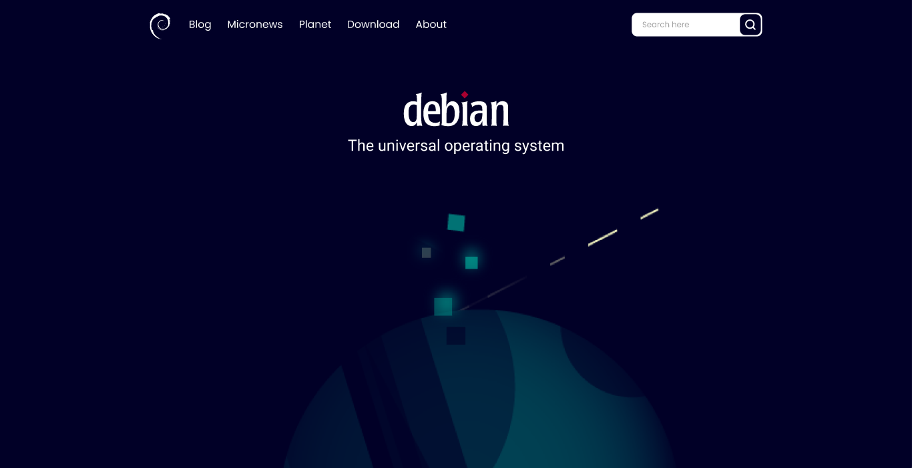

# :penguin: Project Debian website reimagined 

## :dart: Goal 

I noticed a while ago that the [Debian Project](https://www.debian.org/) main page had undergone some changes, but only this week I saw the blog post stating that this is just the beginning and that big changes will come. With that in mind, I took the liberty of reimagining the site based on the theme chosen for the next version of the distro: [Homeworld](https://github.com/julietteTaka/homeworld).

> Part of the artwork on the website is taken from the theme provided by [Juliette Taka](https://github.com/julietteTaka).

If you want access to the prototype, follow the [link to Figma](https://www.figma.com/file/Vc2LzPSqGThTRCIgfa5ibf/Debian-Website-Reimagined?node-id=0%3A1)!

## :scroll: Some details 

* The front end is made with HTML5, CSS3 and JavaScript.

## :thinking: How do I run the project on my machine? 

The first step is to clone the project, either via terminal or GitHub Desktop, or even by downloading the compressed file (.zip). After that, go ahead.

## :hammer_and_wrench: Requirements 

There are no requirements to run the project on your computer! Just double click on the *index.html* file and it will open in your default browser.

## :tada: If everything went well... 

Now you are running the project beautifully!

## :memo: License

This project is under the MIT license. See the [LICENSE](LICENSE) for more information.

---

Made with :blue_heart: by Lucas Coutinho :wave: [Get in touch!](https://www.linkedin.com/in/lucasmc64/)